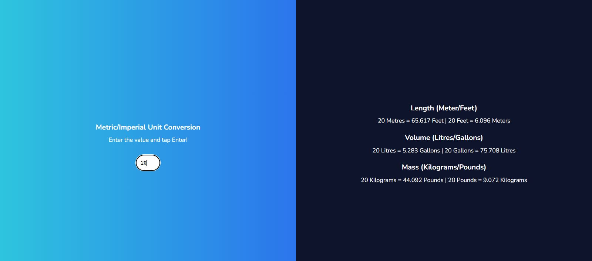
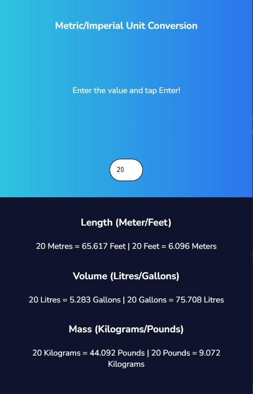

# Unit Converter - Solo project on Scrimba Frontend Career Path

A simple imperial/metric unit converter, that converts meters to feet, litres to gallons, kilograms to pounds, and vice versa. It's been made as Solo project on [Frontend Career Path](https://scrimba.com/learn/frontend), and it helped me a lot in the beginning of my frontend journey, as it combines HTML, CSS and JavaScript knowledge.

## Table of contents

- [Overview](#overview)
  - [Screenshot](#screenshot)
  - [Links](#links)
- [Process](#process)
  - [Built with](#built-with)
- [Author](#author)

## Overview

Users are allowed to enter the number in the input field, and by clicking enter, six imperial/metric conversions of entered number appear on the screen: meters to feet and feet to meters, litres to gallons, gallons to litres, kilograms to pounds and vice versa.

### Screenshot

### Links

- Live Site URL: [Unit converter](https://jelenkoo10.github.io/unit_converter/)

## Process

### Built with

- Semantic HTML5 markup
- Flexbox
- Mobile-first workflow

## Author

- GitHub - [https://github.com/jelenkoo10](https://github.com/jelenkoo10)
- Frontend Mentor - [@jelenkoo10](https://www.frontendmentor.io/profile/jelenkoo10)

